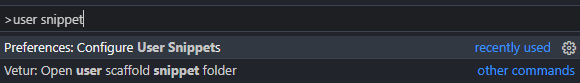
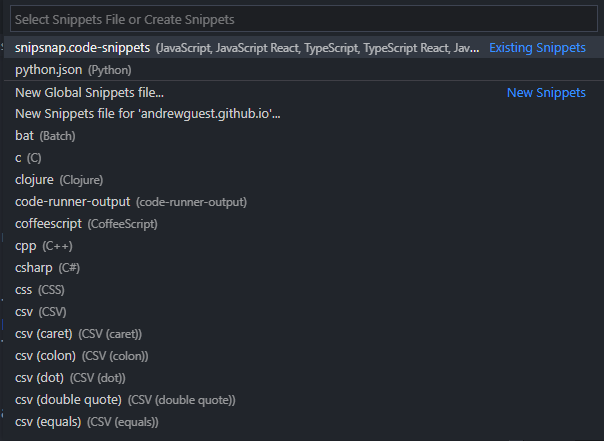
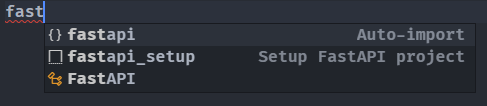
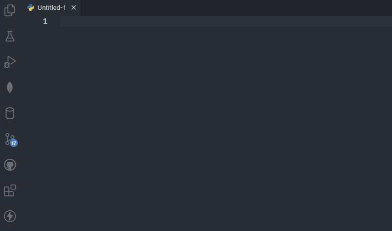

> Code snippets are templates that make it easier to enter repeating code patterns, such as loops or conditional-statements.

Code snippets are awesome and can save you a *lot* of time in some cases. Recently, I tried to find an existing extension in the VSCode Marketplace for the [FastAPI](https://fastapi.tiangolo.com/) web framework but kept coming up blank. This made me finally decide to Google how to create a custom snippet and it was so much easier than I thought it would be.

In this example I'll be going through the steps to create a snippet for the FastAPI framework.

---

### 1) Select the language of the snippet, in this case it's Python.

You can either go to **File** > **Preferences** > **User Snippets** or you can use the command palette by hitting **CTRL** + **SHIFT** + **P** and then searching for "user snippet"



Then either create a new snippets file by selecting "New Global Snippets File..." or choose an existing snippets file. I chose my pre-existing ```python.json``` file.



---

### 2) Create the custom snippet
Snippets are written in JSON and can define an unlimited number of snippets. Here's the snippet I ended up creating:

```json
"Setup the main FastAPI project file.": {
    "prefix": ["fastapi_setup"],
    "body": [
        "from fastapi import FastAPI"
	"",
	"",
	"app = FastAPI(",
	"    title='',",
	"    description='',",
	"    version='0.0.1'",
	")",
	"",
	"",
	"@app.get(\"/\", status_code=200)",
	"async def index(welcome_message: str = \"Hello World!\"):",
	"    return {\"message:\": welcome_message}",
	""
    ],
    "description": "Setup the main FastAPI project file."
},
```

* ```"Setup FastAPI project"``` defines the hint that VSCode shows you when it suggests this snippet.

    

* ```"prefix"``` is what you type into a Python to trigger VSCode to suggest this snippet.
* ```"body"``` is the actual text that VSCode will type into the file when you select this snippet. The value is a list of strings and accepts regular expressions.
* ```"description"``` is the description of this snippet.

---

### 3) The end result
So now that we have this custom code snippet created and saved let's take a look at what happens when you actually use it.



This is pretty sweet and will help save me some time in the future.

---

**Resources:**
 * [https://code.visualstudio.com/docs/editor/userdefinedsnippets#_create-your-own-snippets](https://code.visualstudio.com/docs/editor/userdefinedsnippets#_create-your-own-snippets)
 * [snippet generator app](https://snippet-generator.app)
