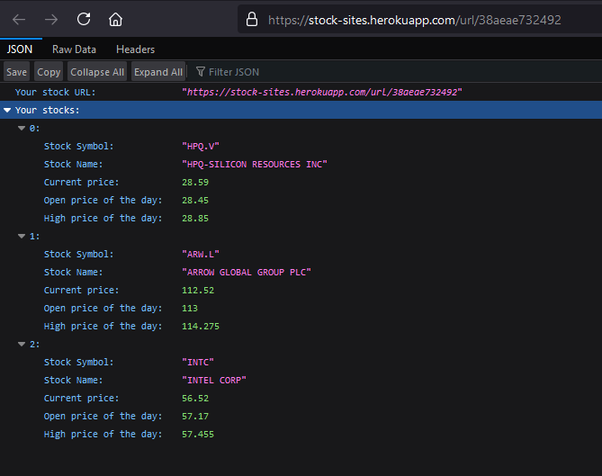
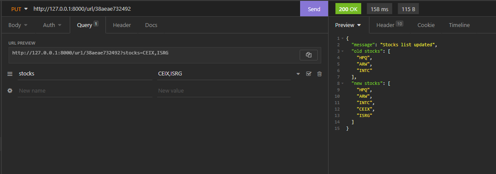

---

### About the project
I like to keep an eye on the price of certain stocks every now and then so I decided to create an API around this idea. Now, this idea is very simple and so I tried to think of a way to make it more interesting. What I came up with is an API that allows you to submit a request with a list of stock symbols and then generate a custom URL for you to visit, at any time, that will display information related to the stock(s) that you submitted.

---

### 1) POST - Generate the custom URL for your stock(s)

Send a POST request to https://stock-sites.herokuapp.com/url/new with a comma-separated list of stock symbols as the value for the "stocks" query parameter.
```
curl -X POST "https://stock-sites.herokuapp.com/url/new" -d "stocks=HPQ,ARW,INTC"
```

You will get the URL for a custom page that will display information related to the stock(s) provided. The URL for this example is:
> https://stock-sites.herokuapp.com/url/38aeae732492


### 2) GET - Visit the custom URL

Now you can go to https://stock-sites.herokuapp.com/url/38aeae732492 and you will see infomration relating to the list of stocks that we supplied earlier (HP, Arrow Electronics, and Intel).




### 3) PUT - Add new stock(s) to the URL

You can add stocks to your URL by, again, sending a query parameter of "stocks" with a comma-separated list of stock symbols and they will be added to the existing list.




### 4) DELETE - Delete the stocks and URL

The URL can be deleted by sending a DELETE request to the custom URL


---

[Try out the API](https://stock-sites.herokuapp.com/docs)

_Note: Allow around 30 seconds for the API to respond to your first request. Heroku puts projects in the "free" tier to sleep if they haven't been visited in a specific amount of time._

