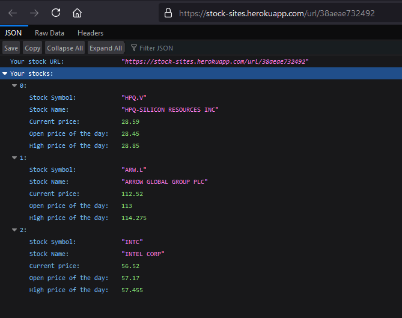
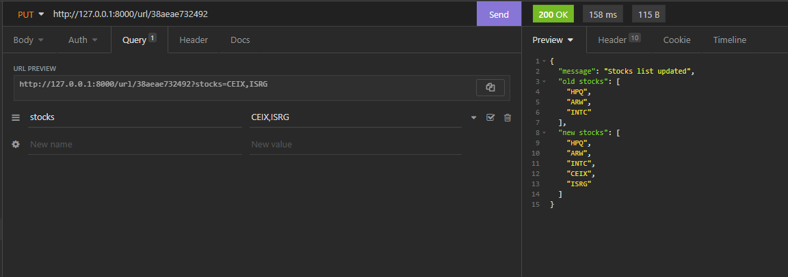
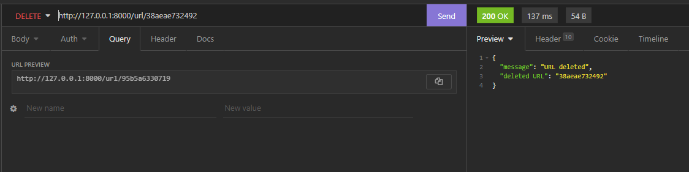

---

## Background information
I love using VS Code and Docker for my projects, and I've been trying to get better about using VS Code's built-in debugger whenever I run into issues.
This post discusses how to setup VS Code to build and run a Docker container whenever you start the debugger (debugger shortcut: **F5**)

My project is setup where the `main.py` file is in the **app/** directory and contains all of the application code.


If you already have a Dockerfile for your project, then you can skip step 1.

---

#### 1) Create the Dockerfile

Send a POST request to https://stock-sites.herokuapp.com/url/new with a comma-separated list of stock symbols as the value for the "stocks" query parameter.
```
curl -X POST "https://stock-sites.herokuapp.com/url/new" -d "stocks=HPQ,ARW,INTC"
```

You will get the URL for a custom page that will display information related to the stock(s) provided. The URL for this example is:
> https://stock-sites.herokuapp.com/url/38aeae732492


#### 2) GET - Visit the custom URL

Now you can go to https://stock-sites.herokuapp.com/url/38aeae732492 and you will see infomration relating to the list of stocks that we supplied earlier (HP, Arrow Electronics, and Intel).




#### 3) PUT - Add new stock(s) to the URL

You can add stocks to your URL by, again, sending a query parameter of "stocks" with a comma-separated list of stock symbols and they will be added to the existing list.




#### 4) DELETE - Delete the stocks and URL

The URL can be deleted by sending a DELETE request to the custom URL



---

[Try out the API](https://stock-sites.herokuapp.com/docs)

_Note: Allow around 30 seconds for the API to respond to your first request. Heroku puts projects in the "free" tier to sleep if they haven't been visited in a specific amount of time._

