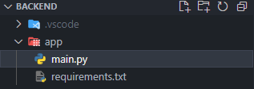

---

## Background information
I love using VS Code and Docker for my projects, and I've been trying to get better about using VS Code's built-in debugger whenever I run into issues.
This post discusses how to setup VS Code to build and run a Docker container whenever you start the debugger (debugger shortcut: **F5**)

My project is setup where the `main.py` file is in the **app/** directory and contains all of the application code.



If you already have a Dockerfile for your project, then you can skip step 1.

---

<br>

### 1) Create the Dockerfile

You can use VS Code to generate a Dockerfile for you by hitting **CTRL+SHIFT+P** and then searching for "Docker: Add Docker Files to Workspace" in the pop-up box.
Then provide answers to the prompts. For me these are the values I provided:

- Select Application Platform: **Python: FastAPI**
- What port(s) does your app listen on?: **8000**
- Include optional Docker Compose files?: **No**

After this you'll have a Dockerfile that will even create a user, inside the container, so that your application doesn't run as root (+1 for security).
The only thing I updated was the **CMD** at the end:

```Dockerfile
CMD ["gunicorn", "--bind", "0.0.0.0:8000", "--workers", "1", "--worker-class", "uvicorn.workers.UvicornWorker", "app.main:app"]
```

---
<br>

### 2) Initialize Docker for debugging

Open the command palette again with **CTRL+SHIFT+P** and then type in "Docker: Initialize for Docker Debugging". Again, answer the prompts which are very similar to the previous ones:

- Select Application Platform: **Python: FastAPI**
- Choose the app's entry point (e.g. manage.py, app.py): **app\.py**

---
<br>

### 3) Update the requirements.txt file

Generating the Dockerfile overwrote my requirements.txt file, but I just activated my virtual environment and updated it with:

```shell
pip freeze > requirements.txt
```

---
<br>

### 4) Run the debugger

Now, you can hit **F5** to start the VS Code debugger which will build an image based on the new Dockerfile and then start a container with that image using Uvicorn, but I use gunicorn in production so that's what I want to use for debugging.

Open the **.vscode/tasks.json** file and update the "python" section to:
```json
"python": {
  "args": [
    "--bind",
    ":8000",
    "--workers",
    "1",
    "--worker-class",
    "uvicorn.workers.UvicornWorker",
    "app.main:app"
  ],
  "module": "gunicorn"
}
```

- Start the debugger: **F5**
- Stop the debugger **SHIFT+F5**
